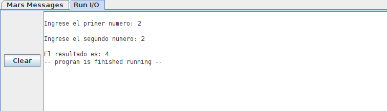
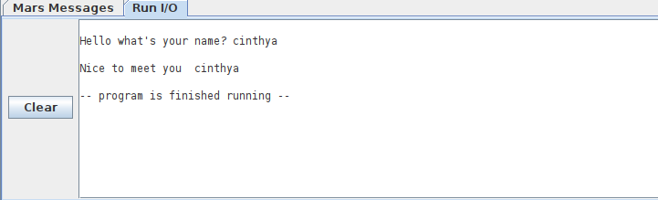
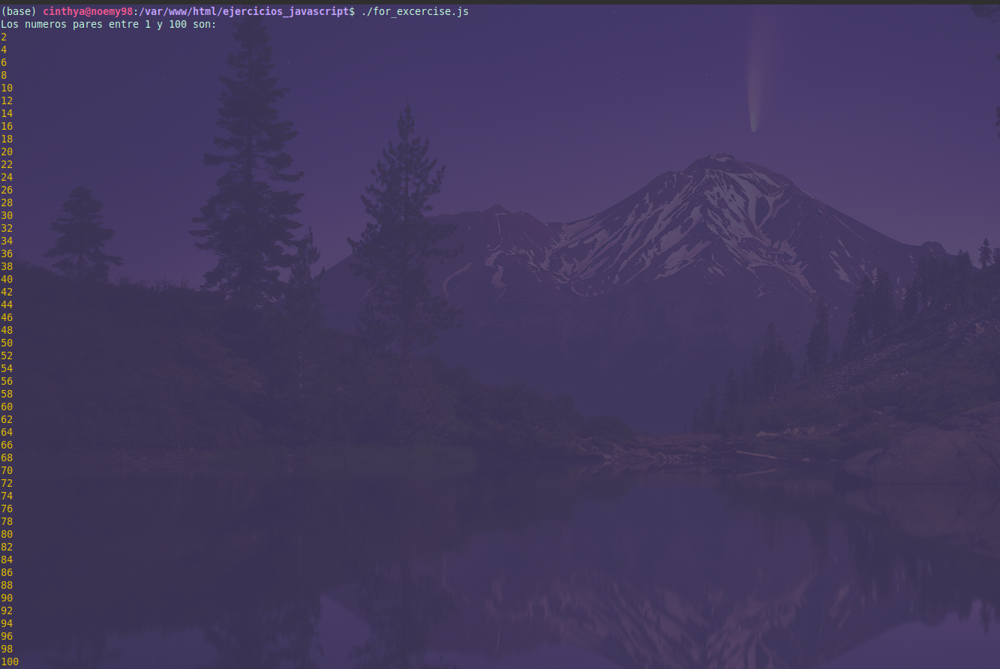

# Week 1

## Week Challenges:

### Thuesday:

#### **1. Interpreted vs Compiled Programming Languages:** ✅

The interpreted programming languages are those that the interpreters execute line by line, so if you want to make a change simply add it and the interpreter transmits it as it happens.

While compiled programming languages are converted directly into machine language, they also require an additional step which is the compilation, in this case, when making a change in the code, the program must be executed again from the beginning to be carried out. For this reason they tend to be faster than the interpreted ones but this is changing with the passage of time.

#### **2. Is Java compiled or interpreted, or both?** ✅

java is a hybrid language since it is interpreted and compiled at the same time in the following way:
- With the compiler, the source code is converted into files with the .java extension.
- Then the interpreter executes each one of these instructions in the computer.

#### **3. Pseudocode currency converter** ✅

```
1. START 
2. AMOUNT <-- GET
3. BTC_value <-- GET
4. RESULT <-- AMOUNT * BTC_value
5. PRINT <-- RESULT
6. END
```

#### **4. Learn about High and Low level languages** ✅

### Wednesday:

#### 1. **Your date of birth in the matrix?** ✅

1111001111

#### 2. **MIPS** ✅

**Exercise 1.**

```assembly
  .data
	      number1: .asciiz "\nIngrese el primer numero: "
	      number2: .asciiz "\nIngrese el segundo numero: "
	      result: .asciiz "\nEl resultado es: "
  .text
	      main:
              li $v0, 4
              la $a0, number1
              syscall

              li $v0, 5
              syscall

              move $t0, $v0

              li $v0, 4
              la $a0, number2
              syscall

              li $v0, 5
              syscall

              move $t1, $v0

              la $a0, result
              li $v0, 4
              syscall
              add $t3, $t0, $t1
              move $a0, $t3
              li $v0, 1
              syscall
              
              li $v0, 10
              syscall
```
Output



**Excercise 2.**

```assembly 
.data
	message: .asciiz "\nHello what's your name?"
	message2: .asciiz "\nNice to meet you "
	userImput: .space 20
	
.text
	main:
	
	li $v0, 4
	la $a0 message
	syscall
	
	li $v0, 8
	la $a0, userImput
	li $a1, 20
	syscall
	
	li $v0, 4
	la $a0 message2
	syscall
	
	li $v0, 4
	la $a0 userImput
	syscall
	
	li $v0, 10
	syscall
```

Output



### Thursday:

#### 1. Print Special Numbers

- For:

```js
#!/usr/bin/env node

let numeros = 0

console.log("Los numeros pares entre 1 y 100 son: ")
for(let numeros = 1; numeros <= 101; numeros++ ){
    if(numeros % 2 == 0){
        console.log(numeros)
    }
}
```
Output



- While:

```js
#!/usr/bin/env node

let numeros = 1
console.log("Los numeros pares entre 1 y 100 son: ")

while(numeros <= 100){
    if(numeros % 2 == 0){
        console.log(numeros)
    }
    numeros++
}
```

- do While:

```js
#!/usr/bin/env node
let numeros = 1

console.log("Los numeros pares entre 1 y 100 son: ")

do{
    if(numeros % 2 == 0){
        console.log(numeros)
    }
    numeros++
}while(numeros <= 100)
```